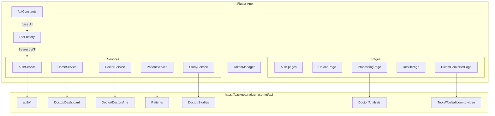

# Flutter–Backend API Integration Plan

## Architecture



## Step 1 — Fix `ApiConstants` base URL and image helper

File: [`lib/core/networking/api_constants.dart`](c:\Users\youss\OneDrive\Desktop\Flutter_GRAD\lib\core\networking\api_constants.dart)

- Change `baseUrl` from `http://10.0.2.2:5104/api/` to `https://backnetgrad.runasp.net/api/`
- Add a static image URL helper:
  ```dart
  static const String _staticBase = 'https://backnetgrad.runasp.net';
  static String getFullImageUrl(String path) =>
      path.startsWith('http') ? path : '$_staticBase/$path';
  ```
- Fix `dicomToVideo` path: backend is `Tools/Tools/dicom-to-video` (already correct in file, verify)
- Fix `analysis` path: inline calls in `ProcessingPage` use `Doctor/Analysis/` — add constant:
  ```dart
  static const String analysis = 'Doctor/Analysis';
  ```

## Step 2 — Define typed models for API responses

Currently most responses are raw `Map<String,dynamic>`. Create/complete these model files:

- **`lib/core/models/auth_result.dart`** — `success`, `message`, `token`, `user` fields matching `AuthResult` from backend
- **`lib/core/models/patient_model.dart`** — `id`, `name`, `age`, `gender`, `contactNumber`, `medicalHistory`, `studies: List<StudyModel>` (already partially in `lib/pages/models/patient_history_model.dart` — reuse/complete it)
- **`lib/core/models/study_model.dart`** — `id`, `filePath`, `status`, `uploadDate`, `analysisResults: List<AnalysisResultModel>`
- **`lib/core/models/analysis_result_model.dart`** — `studyId`, `stenosisPercentage`, `report`, `imagePath`, `arteryName`, `riskLevel`, `diagnosisDetails`, `patientName`

These replace raw `Map` parsing scattered across pages.

## Step 3 — Wire the four unconnected auth flows

File: [`lib/core/services/auth_service.dart`](c:\Users\youss\OneDrive\Desktop\Flutter_GRAD\lib\core\services\auth_service.dart)

Add methods mapping to backend endpoints:

| Flutter Page | Backend endpoint | Method to add |
| --- | --- | --- |
| `ForgetPasswordPage` | `POST api/auth/forgot-password` | `forgotPassword(email)` |
| `VerifyCodePage` | `POST api/auth/verify-otp` | `verifyOtp(email, otp)` |
| `CreateNewPasswordPage` | `POST api/auth/reset-password` | `resetPassword(email, otp, newPassword)` |
| `ChangePasswordPage` | `POST api/auth/change-password` | `changePassword(currentPassword, newPassword)` |
| `UpdateEmailPage` | `POST api/auth/update-email` | `updateEmail(newEmail, password)` |

Then replace the `// Simulate API` stubs in:
- [`lib/pages/auth/forget_password_page.dart`](c:\Users\youss\OneDrive\Desktop\Flutter_GRAD\lib\pages\auth\forget_password_page.dart)
- [`lib/pages/auth/verify_code_page.dart`](c:\Users\youss\OneDrive\Desktop\Flutter_GRAD\lib\pages\auth\verify_code_page.dart)
- [`lib/pages/auth/create_new_password_page.dart`](c:\Users\youss\OneDrive\Desktop\Flutter_GRAD\lib\pages\auth\create_new_password_page.dart)
- [`lib/pages/profile/change_password_page.dart`](c:\Users\youss\OneDrive\Desktop\Flutter_GRAD\lib\pages\profile\change_password_page.dart)
- [`lib/pages/profile/update_email_page.dart`](c:\Users\youss\OneDrive\Desktop\Flutter_GRAD\lib\pages\profile\update_email_page.dart)

## Step 4 — Consolidate inline Dio calls into `StudyService`

File: [`lib/core/services/study_service.dart`](c:\Users\youss\OneDrive\Desktop\Flutter_GRAD\lib\core\services\study_service.dart)

The service already has the right method signatures but is never imported. Complete it:
- `uploadStudy(patientId, File file)` → `POST api/Doctor/Studies/upload` (multipart)
- `analyzeStudy(int studyId)` → `POST api/Doctor/Analysis/{studyId}`
- `getAnalysisResult(int studyId)` → `GET api/Doctor/Analysis/{studyId}`

Then replace the inline Dio blocks in:
- [`lib/pages/analysis/upload_page.dart`](c:\Users\youss\OneDrive\Desktop\Flutter_GRAD\lib\pages\analysis\upload_page.dart) — replace inline multipart with `StudyService.uploadStudy`
- [`lib/pages/analysis/processing_page.dart`](c:\Users\youss\OneDrive\Desktop\Flutter_GRAD\lib\pages\analysis\processing_page.dart) — replace inline with `StudyService.analyzeStudy`

## Step 5 — Fix analysis result page PDF generation

File: [`lib/pages/analysis/result_page.dart`](c:\Users\youss\OneDrive\Desktop\Flutter_GRAD\lib\pages\analysis\result_page.dart)

- The "Download Clinical Report" button currently only shows a SnackBar
- Replace with a call to `ReportService.generatePdfReport` (already used in `case_details.dart` — reuse same pattern)
- Pass the `AnalysisResultModel` data to the PDF generator

## Step 6 — Verify `PatientService` field names

File: [`lib/core/services/patient_service.dart`](c:\Users\youss\OneDrive\Desktop\Flutter_GRAD\lib\core\services\patient_service.dart)

Backend `CreatePatientRequest` / `UpdatePatientRequest` fields (from DTOs): confirm the JSON keys sent from Flutter match. Key ones to verify: `name`, `age`, `gender`, `contactNumber`, `medicalHistory`.

Also add `getPatientById(int id)` → `GET api/Patients/{id}` (missing from service but needed by `PatientProfilePage`).

## Step 7 — Fix static file URLs for images

Anywhere a `filePath` or `imagePath` from the backend is displayed in an `Image.network`:
- Profile images stored at `/profiles/{file}` → full URL `https://backnetgrad.runasp.net/profiles/{file}`
- Study/analysis images stored at `uploads/...` or `analysis/result_{id}.png`
- Use the `ApiConstants.getFullImageUrl(path)` helper from Step 1 consistently in `ProfilePage`, `ResultPage`, `CaseDetailsPage`, and `PatientProfilePage`

## Step 8 — Fix missing onboarding route (minor)

File: [`lib/core/routing/app_router.dart`](c:\Users\youss\OneDrive\Desktop\Flutter_GRAD\lib\core\routing\app_router.dart)

Add a `GoRoute` for `AppRoutes.onboarding` → `OnboardingPage` so the route is reachable (e.g. for first-run flow from splash).

---

## Files changed summary

| File | Change |
| --- | --- |
| `lib/core/networking/api_constants.dart` | Production base URL, image helper, path constants |
| `lib/core/models/*.dart` (4 new) | Typed models for Auth, Patient, Study, AnalysisResult |
| `lib/core/services/auth_service.dart` | 5 new methods for password reset + change + update email |
| `lib/core/services/study_service.dart` | Complete + activate uploadStudy / analyzeStudy / getResult |
| `lib/pages/auth/forget_password_page.dart` | Wire `forgotPassword` |
| `lib/pages/auth/verify_code_page.dart` | Wire `verifyOtp` |
| `lib/pages/auth/create_new_password_page.dart` | Wire `resetPassword` |
| `lib/pages/profile/change_password_page.dart` | Wire `changePassword` |
| `lib/pages/profile/update_email_page.dart` | Wire `updateEmail` |
| `lib/pages/analysis/upload_page.dart` | Use `StudyService` |
| `lib/pages/analysis/processing_page.dart` | Use `StudyService` |
| `lib/pages/analysis/result_page.dart` | Wire PDF generation |
| `lib/core/services/patient_service.dart` | Add `getPatientById`, verify field names |
| `lib/core/routing/app_router.dart` | Add onboarding route |
